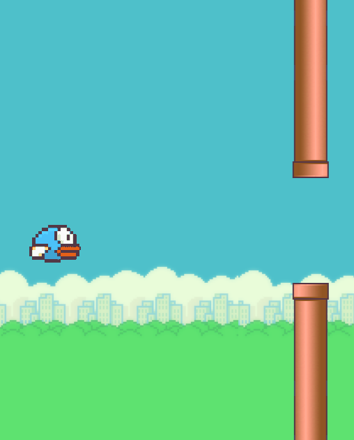

# Soaring Avians

Pure HTML/CSS/JS recreation of flappy bird, for a Computer Science course

## Credit(s)
= [https://github.com/samuelcust/flappy-bird-assets](samuelcust/flappy-bird-assets) - Assets relating to flappy bird
- [https://github.com/ChakornK/oneui-icons/blob/main/scripts%2Fxml2svg.js](ChakornK's Xml2Svg Script) - For converting android assets to a readable format on this project
- [https://github.com/hushenghao/AndroidEasterEggs](hushenghao/AndroidEasterEggs) - Providing Assets relating to the Android 5/6 "flappy droid" easter egg
